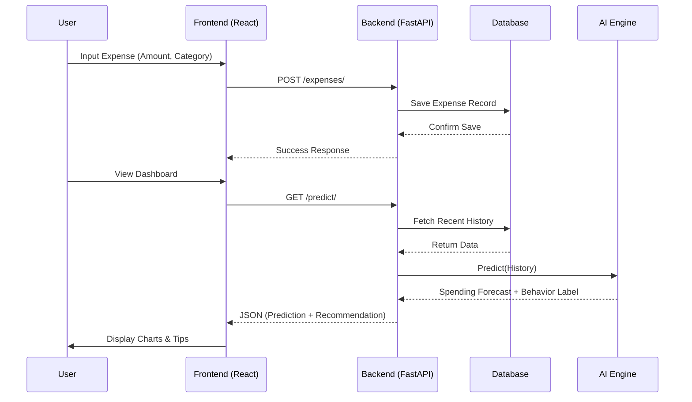

# System Architecture & Data Flow

## 1. System Architecture
The application follows a client-server architecture with a clear separation of concerns.

```mermaid
graph TD
    Client[React Frontend] -->|HTTP/JSON| API[FastAPI Backend]
    API -->|ORM| DB[(SQLite Database)]
    API -->|Inference| AI[AI Engine (Scikit-Learn)]
    AI -->|Load| Model[[Trained Models (.pkl)]]
    
    subgraph Backend
    API
    DB
    AI
    Model
    end
    
    subgraph Frontend
    Client
    end
```

## 2. Data Flow Diagram
How data moves from the user to the database and AI components.


